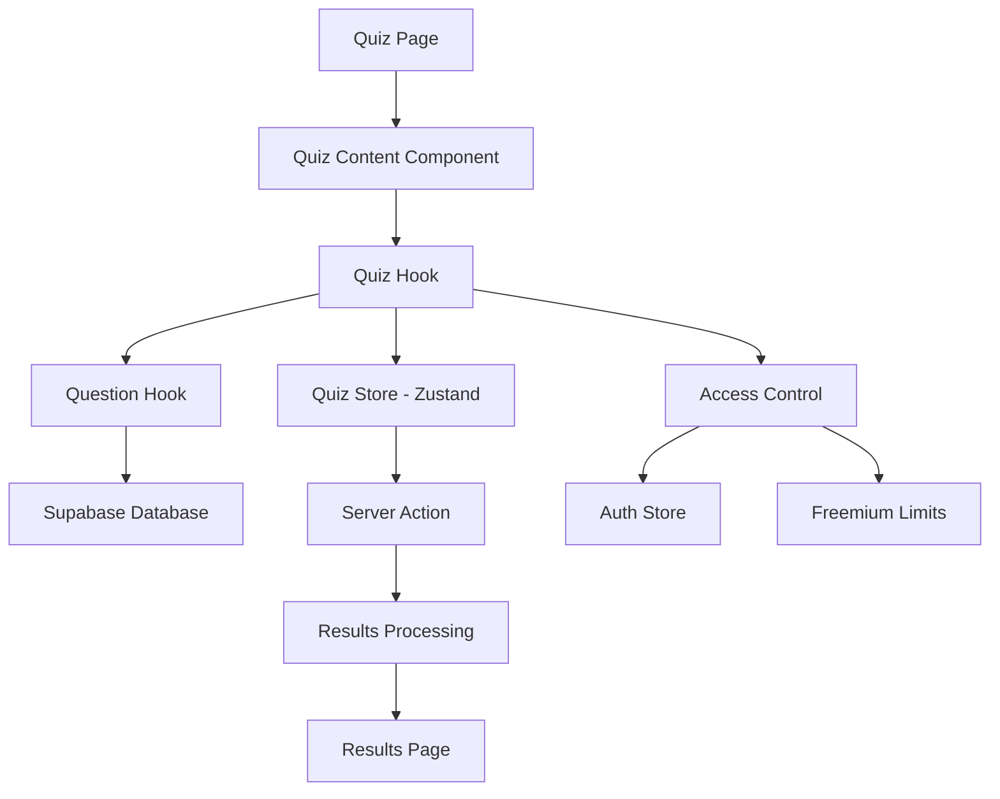

# Interactive Quiz System Implementation

A comprehensive guide for building a multi-modal quiz system with **Next.js 14**, **TypeScript**, **Zustand state management**, and **Supabase database integration**. This system supports multiple quiz types, real-time scoring, progress tracking, and both authenticated and guest user experiences.

## Table of Contents

- [System Overview](#system-overview)
- [Architecture](#architecture)
- [Technology Stack](#technology-stack)
- [Database Schema](#1-database-schema)
- [State Management](#2-state-management)
- [Quiz Types](#3-quiz-types)
- [Core Components](#4-core-components)
- [Hooks & Logic](#5-hooks--logic)
- [Server Actions](#6-server-actions)
- [User Experience](#7-user-experience)
- [Integration Setup](#8-integration-setup)

## System Overview

This quiz system provides a comprehensive learning platform with multiple quiz modes, intelligent question management, and detailed progress tracking.

### Key Features

- ✅ **Multiple Quiz Types** - Timed(Simulation), and Practice modes
- ✅ **Smart Question Management** - Random selection, incorrect question tracking
- ✅ **Real-time Progress Tracking** - Live scoring and completion status
- ✅ **Access Control Integration** - Freemium limits and authentication
- ✅ **Responsive Design** - Mobile-first approach with touch-friendly UI
- ✅ **Accessibility** - WCAG compliant with keyboard navigation
- ✅ **Guest & Authenticated Modes** - Full functionality for both user types
- ✅ **Advanced Analytics** - Detailed attempt tracking and performance metrics

### Quiz Types

1. **Simulation** - 20 questions, 30-minute time limit, high-pressure simulation
2. **Practice Quiz** - Flexible length, educational feedback, progress tracking
3. **Incorrect Questions Practice** - Targeted review of previously missed questions

## Architecture



## Technology Stack

### Core Technologies

- **Frontend**: Next.js 14 (App Router), React 18, TypeScript
- **State Management**: Zustand with DevTools integration
- **Database**: Supabase with PostgreSQL + RPC functions
- **Data Fetching**: TanStack Query for optimized caching
- **Styling**: Tailwind CSS with Shadcn UI components
- **Analytics**: Built-in tracking with custom events

### Key Libraries

```json
{
  "zustand": "^4.4.7",
  "@tanstack/react-query": "^5.0.0",
  "@supabase/supabase-js": "^2.38.4",
  "@radix-ui/react-progress": "^1.0.3",
  "lucide-react": "^0.294.0"
}
```

## 1. Database Schema

### Core Tables

```sql
-- Questions table
CREATE TABLE questions (
  id SERIAL PRIMARY KEY,
  question_text TEXT NOT NULL,
  option_a TEXT NOT NULL,
  option_b TEXT NOT NULL,
  option_c TEXT NOT NULL,
  option_d TEXT NOT NULL,
  correct_option CHAR(1) NOT NULL CHECK (correct_option IN ('a', 'b', 'c', 'd')),
  category VARCHAR(100),
  difficulty_level VARCHAR(20) DEFAULT 'medium',
  created_at TIMESTAMPTZ DEFAULT NOW(),
  updated_at TIMESTAMPTZ DEFAULT NOW()
);

-- Quiz attempts tracking
CREATE TABLE quiz_attempts (
  id SERIAL PRIMARY KEY,
  user_id UUID REFERENCES auth.users(id),
  quiz_type VARCHAR(50) NOT NULL,
  score INTEGER NOT NULL,
  total_questions_in_attempt INTEGER NOT NULL,
  user_answers JSONB NOT NULL,
  question_ids INTEGER[] NOT NULL,
  is_timed BOOLEAN DEFAULT FALSE,
  is_practice BOOLEAN DEFAULT FALSE,
  practice_type VARCHAR(50),
  time_taken_seconds INTEGER,
  created_at TIMESTAMPTZ DEFAULT NOW(),
  updated_at TIMESTAMPTZ DEFAULT NOW()
);

-- User incorrect questions for targeted practice
CREATE TABLE user_incorrect_questions (
  id SERIAL PRIMARY KEY,
  user_id UUID REFERENCES auth.users(id),
  question_id INTEGER REFERENCES questions(id),
  created_at TIMESTAMPTZ DEFAULT NOW(),
  UNIQUE(user_id, question_id)
);

-- Freemium usage tracking
CREATE TABLE user_freemium_quiz_counts (
  id UUID DEFAULT gen_random_uuid() PRIMARY KEY,
  user_id UUID REFERENCES profiles(id),
  mode VARCHAR(20) NOT NULL,
  count INTEGER DEFAULT 0,
  created_at TIMESTAMPTZ DEFAULT NOW(),
  updated_at TIMESTAMPTZ DEFAULT NOW(),
  UNIQUE(user_id, mode)
);
```

### Database Functions

```sql
-- Get random questions for standard/timed quizzes
CREATE OR REPLACE FUNCTION get_random_questions(question_limit INTEGER DEFAULT 20)
RETURNS TABLE (
  id INTEGER,
  question_text TEXT,
  option_a TEXT,
  option_b TEXT,
  option_c TEXT,
  option_d TEXT,
  correct_option CHAR(1)
)
LANGUAGE SQL STABLE
AS $$
  SELECT q.id, q.question_text, q.option_a, q.option_b, q.option_c, q.option_d, q.correct_option
  FROM questions q
  ORDER BY RANDOM()
  LIMIT question_limit;
$$;

-- Get incorrect questions for targeted practice
CREATE OR REPLACE FUNCTION get_incorrect_questions(user_id_param UUID)
RETURNS TABLE (
  id INTEGER,
  question_text TEXT,
  option_a TEXT,
  option_b TEXT,
  option_c TEXT,
  option_d TEXT,
  correct_option CHAR(1)
)
LANGUAGE SQL STABLE
AS $$
  SELECT q.id, q.question_text, q.option_a, q.option_b, q.option_c, q.option_d, q.correct_option
  FROM questions q
  INNER JOIN user_incorrect_questions uiq ON q.id = uiq.question_id
  WHERE uiq.user_id = user_id_param
  ORDER BY uiq.created_at DESC;
$$;

-- Get random practice questions (avoiding recently seen)
CREATE OR REPLACE FUNCTION get_random_practice_questions(
  user_id_param UUID DEFAULT NULL,
  question_limit INTEGER DEFAULT 10,
  incorrect_only BOOLEAN DEFAULT FALSE
)
RETURNS TABLE (
  id INTEGER,
  question_text TEXT,
  option_a TEXT,
  option_b TEXT,
  option_c TEXT,
  option_d TEXT,
  correct_option CHAR(1)
)
LANGUAGE SQL STABLE
AS $$
  SELECT q.id, q.question_text, q.option_a, q.option_b, q.option_c, q.option_d, q.correct_option
  FROM questions q
  WHERE (
    incorrect_only = FALSE OR
    q.id IN (
      SELECT question_id
      FROM user_incorrect_questions
      WHERE user_id = user_id_param
    )
  )
  ORDER BY RANDOM()
  LIMIT question_limit;
$$;

-- Increment quiz attempt counters
CREATE OR REPLACE FUNCTION increment_user_quiz_mode_attempts(
  p_user_id UUID,
  p_quiz_mode VARCHAR(20)
)
RETURNS VOID
LANGUAGE SQL
AS $$
  INSERT INTO user_freemium_quiz_counts (user_id, mode, count)
  VALUES (p_user_id, p_quiz_mode, 1)
  ON CONFLICT (user_id, mode)
  DO UPDATE SET
    count = user_freemium_quiz_counts.count + 1,
    updated_at = NOW();
$$;
```

## 2. State Management

### Quiz Store with Zustand

```typescript
// stores/quiz/types.ts
export interface QuizState {
  questions: Question[];
  currentQuestionIndex: number;
  selectedAnswers: Record<number, string>; // questionId -> selected option
  mode: QuizMode;
  status: "idle" | "loading" | "active" | "submitting" | "completed" | "error";
  error: string | null;
  timer: {
    startTime: number | null;
    endTime: number | null;
    duration: number;
  };
  attempt: {
    id: string | null;
    score: number | null;
    submittedAt: string | null;
  };
  settings: {
    questionsPerQuiz: number;
    timeLimit: number;
  };
}

export interface QuizActions {
  initializeQuiz: (
    mode: QuizMode,
    settings?: Partial<QuizState["settings"]>
  ) => Promise<void>;
  selectAnswer: (questionId: number, answer: string) => void;
  nextQuestion: () => void;
  previousQuestion: () => void;
  submitQuiz: () => Promise<void>;
  resetQuiz: () => void;
  startTimer: () => void;
  stopTimer: () => void;
  setCurrentQuestion: (index: number) => void;
  updateSettings: (settings: Partial<QuizState["settings"]>) => void;
}

export type QuizStore = QuizState & QuizActions;
```

### Store Implementation

```typescript
// stores/quiz/quizStore.ts
import { create } from "zustand";
import { devtools } from "zustand/middleware";
import { submitQuizAttempt } from "@/app/actions/submit-quiz-attempt";
import { useAuthStore } from "../auth/authStore";

const initialState: QuizState = {
  questions: [],
  currentQuestionIndex: 0,
  selectedAnswers: {},
  mode: "practice",
  status: "idle",
  error: null,
  timer: {
    startTime: null,
    endTime: null,
    duration: 0,
  },
  attempt: {
    id: null,
    score: null,
    submittedAt: null,
  },
  settings: {
    questionsPerQuiz: 20,
    timeLimit: 1800, // 30 minutes
  },
};

export const useQuizStore = create<QuizStore>()(
  devtools(
    (set, get) => ({
      ...initialState,

      initializeQuiz: async (mode, settings) => {
        set({ status: "loading", mode });
        const user = useAuthStore.getState().user;
        const newSettings = { ...get().settings, ...settings };

        try {
          let questions;

          // Load questions based on quiz mode
          if (mode === "incorrect" && user) {
            const result = await supabase.rpc("get_incorrect_questions", {
              user_id_param: user.id,
            });
            questions = result.data;
          } else if (mode === "practice") {
            const result = await supabase.rpc("get_random_practice_questions", {
              user_id_param: user?.id || null,
              question_limit: newSettings.questionsPerQuiz,
            });
            questions = result.data;
          } else {
            const result = await supabase.rpc("get_random_questions", {
              question_limit: newSettings.questionsPerQuiz,
            });
            questions = result.data;
          }

          set({
            questions: questions || [],
            status: questions?.length ? "active" : "error",
            error: questions?.length ? null : "No questions available",
            currentQuestionIndex: 0,
            selectedAnswers: {},
            settings: newSettings,
            timer: { ...initialState.timer, startTime: Date.now() },
          });
        } catch (error) {
          set({
            error: (error as Error).message,
            status: "error",
          });
        }
      },

      selectAnswer: (questionId, answer) =>
        set((state) => ({
          selectedAnswers: { ...state.selectedAnswers, [questionId]: answer },
        })),

      nextQuestion: () => {
        const { currentQuestionIndex, questions } = get();
        if (currentQuestionIndex < questions.length - 1) {
          set({ currentQuestionIndex: currentQuestionIndex + 1 });
        }
      },

      previousQuestion: () => {
        const { currentQuestionIndex } = get();
        if (currentQuestionIndex > 0) {
          set({ currentQuestionIndex: currentQuestionIndex - 1 });
        }
      },

      submitQuiz: async () => {
        const state = get();
        set({ status: "submitting" });

        try {
          // Prepare submission data
          const userAnswers: Record<string, string> = {};
          const questionIds = state.questions.map((q, index) => {
            if (state.selectedAnswers[q.id]) {
              userAnswers[String(index)] = state.selectedAnswers[q.id];
            }
            return q.id;
          });

          const result = await submitQuizAttempt({
            userAnswers,
            questionIds,
            timeTaken: state.timer.duration,
            practiceType: state.mode === "practice" ? "general" : undefined,
            quizMode: state.mode === "practice" ? "practice" : state.mode,
          });

          if (result.error) throw new Error(result.error);

          set({
            status: "completed",
            attempt: {
              id: result.attemptId ? String(result.attemptId) : null,
              score: result.score || 0,
              submittedAt: new Date().toISOString(),
            },
          });
        } catch (error) {
          set({
            error: (error as Error).message,
            status: "error",
          });
        }
      },

      startTimer: () =>
        set((state) => ({
          timer: { ...state.timer, startTime: Date.now() },
        })),

      stopTimer: () =>
        set((state) => {
          const duration = state.timer.startTime
            ? Math.floor((Date.now() - state.timer.startTime) / 1000)
            : 0;
          return {
            timer: {
              ...state.timer,
              endTime: Date.now(),
              duration,
            },
          };
        }),

      resetQuiz: () => set(initialState),

      setCurrentQuestion: (index) => {
        const { questions } = get();
        if (index >= 0 && index < questions.length) {
          set({ currentQuestionIndex: index });
        }
      },

      updateSettings: (settings) =>
        set((state) => ({
          settings: { ...state.settings, ...settings },
        })),
    }),
    { name: "quiz-store" }
  )
);
```

## 3. Quiz Types

### Standard Quiz Implementation

```typescript
// hooks/useStandardQuiz.ts
import { useState, useEffect, useCallback, useMemo } from "react";
import { useRouter } from "next/navigation";
import { useAuthStore } from "@/stores";
import { useQuizStore } from "@/stores/quiz/quizStore";
import { checkQuizAccess } from "@/app/actions/check-quiz-access";

export function useStandardQuiz() {
  const router = useRouter();
  const user = useAuthStore((state) => state.user);
  const authLoading = useAuthStore((state) => state.isLoading);

  // Access control state
  const [canAttempt, setCanAttempt] = useState(false);
  const [limitMessage, setLimitMessage] = useState("");
  const [isCheckingLimits, setIsCheckingLimits] = useState(true);

  // Quiz store state
  const {
    status,
    error,
    questions,
    currentQuestionIndex,
    selectedAnswers,
    attempt,
    initializeQuiz,
    resetQuiz,
    submitQuiz,
    selectAnswer: selectAnswerStore,
    nextQuestion,
    previousQuestion,
  } = useQuizStore();

  // UI state
  const [showUnauthResults, setShowUnauthResults] = useState(false);
  const [isEndQuizModalOpen, setIsEndQuizModalOpen] = useState(false);

  // Derived state
  const isSubmitting = status === "submitting";
  const isQuizActive = status === "active" && questions.length > 0;
  const isLoading = useMemo(() => {
    return (
      status === "loading" ||
      status === "submitting" ||
      (status === "completed" && !showUnauthResults) ||
      authLoading ||
      isCheckingLimits
    );
  }, [status, showUnauthResults, authLoading, isCheckingLimits]);

  // Access control check
  useEffect(() => {
    const checkAccess = async () => {
      if (authLoading) return;

      setIsCheckingLimits(true);
      try {
        const result = user
          ? await checkQuizAccess("standard")
          : await checkUnauthenticatedUserLimits("standard");

        setCanAttempt(result.canAttempt);
        if (!result.canAttempt) {
          setLimitMessage(result.message);
        }
      } catch (error) {
        setCanAttempt(false);
        setLimitMessage("Access check failed");
      } finally {
        setIsCheckingLimits(false);
      }
    };

    checkAccess();
  }, [user, authLoading]);

  // Quiz initialization
  useEffect(() => {
    if (!canAttempt || authLoading || isCheckingLimits) return;

    resetQuiz();
    const timer = setTimeout(() => {
      initializeQuiz("standard");
    }, 50);

    return () => {
      clearTimeout(timer);
      resetQuiz();
    };
  }, [canAttempt, authLoading, isCheckingLimits]);

  // Handle completion
  useEffect(() => {
    if (status !== "completed") return;

    if (attempt.id) {
      // Authenticated user - redirect to results
      setTimeout(() => {
        router.push(`/results/${attempt.id}`);
      }, 100);
    } else if (attempt.score !== null) {
      // Unauthenticated user - show inline results
      setShowUnauthResults(true);
    }
  }, [status, attempt.id, attempt.score, router]);

  // Quiz control handlers
  const selectAnswer = useCallback(
    (answer: string) => {
      const currentQuestion = questions[currentQuestionIndex];
      if (currentQuestion) {
        selectAnswerStore(currentQuestion.id, answer);
      }
    },
    [currentQuestionIndex, questions, selectAnswerStore]
  );

  const handleEndQuiz = useCallback(() => {
    setIsEndQuizModalOpen(true);
  }, []);

  const handleConfirmEndQuiz = useCallback(async () => {
    setIsEndQuizModalOpen(false);
    await submitQuiz();
  }, [submitQuiz]);

  // Return comprehensive quiz state
  const currentQuestion = questions[currentQuestionIndex];
  const progress = ((currentQuestionIndex + 1) / (questions.length || 1)) * 100;

  return {
    // State flags
    isLoading,
    isSubmitting,
    isQuizActive,
    showUnauthResults,
    isEndQuizModalOpen,
    canAttempt,

    // Messages
    loadingMessage: isLoading ? "Loading quiz..." : null,
    limitMessage,

    // Quiz data
    quiz: {
      currentQuestion,
      selectedAnswers,
      currentQuestionIndex,
      progress,
      questions,
    },

    // Handlers
    handlers: {
      selectAnswer,
      previousQuestion,
      nextQuestion,
      handleEndQuiz,
      handleConfirmEndQuiz,
      finishQuiz: submitQuiz,
    },

    // Auth info
    isAuthenticated: !!user,
    error,
  };
}
```

### Timed Quiz with Countdown

```typescript
// hooks/useTimedQuiz.ts
import { useState, useEffect, useCallback, useMemo } from "react";
import { TIMED_QUIZ_DURATION } from "@/lib/quizlimits/constants";

export function useTimedQuiz() {
  // ... similar structure to useStandardQuiz

  const TIME_LIMIT = TIMED_QUIZ_DURATION; // 30 minutes

  // Calculate remaining time
  const timeRemaining = useMemo(() => {
    if (!timer.startTime) return TIME_LIMIT;
    const elapsed = Math.floor((Date.now() - timer.startTime) / 1000);
    return Math.max(0, TIME_LIMIT - elapsed);
  }, [timer.startTime]);

  // Auto-submit when time expires
  useEffect(() => {
    if (timeRemaining === 0 && isQuizActive) {
      stopTimer();
      submitQuiz();
    }
  }, [timeRemaining, isQuizActive, stopTimer, submitQuiz]);

  return {
    // All standard quiz functionality plus:
    timeRemaining,
    // ... other returns
  };
}
```

## 4. Core Components

### Quiz View Component

```tsx
// components/quiz/StandardQuizView.tsx
import { Button } from "@/components/ui/button";
import {
  Card,
  CardContent,
  CardFooter,
  CardHeader,
  CardTitle,
} from "@/components/ui/card";
import { Progress } from "@/components/ui/progress";

interface StandardQuizViewProps {
  readonly quiz: {
    readonly currentQuestion: Question;
    readonly selectedAnswers: Record<number, string>;
    readonly currentQuestionIndex: number;
    readonly progress: number;
    readonly questions: readonly Question[];
  };
  readonly handlers: {
    readonly handleAnswerSelect: (option: string) => void;
    readonly handleNext: () => void;
    readonly handlePrevious: () => void;
    readonly handleEndQuiz: () => void;
    readonly finishQuiz: () => void;
  };
  readonly uiFlags: {
    readonly isSubmitting: boolean;
  };
}

export function StandardQuizView({
  quiz,
  handlers,
  uiFlags,
}: StandardQuizViewProps) {
  const {
    currentQuestion,
    selectedAnswers,
    currentQuestionIndex,
    progress,
    questions,
  } = quiz;
  const {
    handleAnswerSelect,
    handleNext,
    handlePrevious,
    handleEndQuiz,
    finishQuiz,
  } = handlers;
  const { isSubmitting } = uiFlags;

  const isLastQuestion = currentQuestionIndex === questions.length - 1;

  const getOptionValue = (option: string): string => {
    switch (option) {
      case "a":
        return currentQuestion.option_a;
      case "b":
        return currentQuestion.option_b;
      case "c":
        return currentQuestion.option_c;
      case "d":
        return currentQuestion.option_d;
      default:
        return "";
    }
  };

  return (
    <div className="max-w-3xl w-full space-y-6">
      {/* Progress Header */}
      <div className="flex justify-between items-center mb-6">
        <h2 className="text-xl font-medium">
          Question {currentQuestionIndex + 1} of {questions.length}
        </h2>
        <Button
          variant="destructive"
          onClick={handleEndQuiz}
          disabled={isSubmitting}
          size="sm"
        >
          End Quiz
        </Button>
      </div>

      {/* Progress Bar */}
      <Progress value={progress} className="h-2" />

      {/* Question Card */}
      <Card className="w-full">
        <CardHeader>
          <CardTitle className="text-xl">
            {currentQuestion.question_text}
          </CardTitle>
        </CardHeader>

        <CardContent className="space-y-4">
          {["a", "b", "c", "d"].map((option) => (
            <div
              key={option}
              className={`p-4 border rounded-lg cursor-pointer transition-colors ${
                selectedAnswers[currentQuestion.id] === option
                  ? "border-blue-600 bg-blue-50"
                  : "hover:bg-gray-50"
              }`}
              onClick={() => !isSubmitting && handleAnswerSelect(option)}
              onKeyDown={(e) => {
                if (!isSubmitting && e.key === "Enter") {
                  handleAnswerSelect(option);
                }
              }}
              role="button"
              tabIndex={isSubmitting ? -1 : 0}
              aria-pressed={selectedAnswers[currentQuestion.id] === option}
              aria-disabled={isSubmitting}
            >
              <div className="flex items-start gap-3">
                <div
                  className={`flex h-6 w-6 shrink-0 items-center justify-center rounded-full border ${
                    selectedAnswers[currentQuestion.id] === option
                      ? "border-blue-600 bg-blue-600 text-white"
                      : "border-gray-300"
                  }`}
                >
                  <span className="text-sm font-medium">
                    {option.toUpperCase()}
                  </span>
                </div>
                <span className="text-left">{getOptionValue(option)}</span>
              </div>
            </div>
          ))}
        </CardContent>

        {/* Navigation Footer */}
        <CardFooter className="flex justify-between items-center gap-4">
          <Button
            variant="outline"
            onClick={handlePrevious}
            disabled={currentQuestionIndex === 0 || isSubmitting}
          >
            Previous
          </Button>

          <div className="text-sm text-gray-600">
            {selectedAnswers[currentQuestion.id] ? "Answered" : "Not answered"}
          </div>

          <Button
            onClick={isLastQuestion ? finishQuiz : handleNext}
            disabled={!selectedAnswers[currentQuestion.id] || isSubmitting}
          >
            {isSubmitting
              ? "Submitting..."
              : isLastQuestion
              ? "Finish Quiz"
              : "Next Question"}
          </Button>
        </CardFooter>
      </Card>
    </div>
  );
}
```

### Timer Component for Timed Quizzes

```tsx
// components/Timer.tsx
import { useEffect, useState } from "react";
import { Alert, AlertDescription } from "@/components/ui/alert";
import { Clock } from "lucide-react";

interface TimerProps {
  timeRemaining: number;
  onTimeUp: () => void;
  showWarning?: boolean;
}

export function Timer({
  timeRemaining,
  onTimeUp,
  showWarning = true,
}: TimerProps) {
  const [lastSecond, setLastSecond] = useState(timeRemaining);

  useEffect(() => {
    if (timeRemaining === 0 && lastSecond > 0) {
      onTimeUp();
    }
    setLastSecond(timeRemaining);
  }, [timeRemaining, lastSecond, onTimeUp]);

  const formatTime = (seconds: number) => {
    const minutes = Math.floor(seconds / 60);
    const remainingSeconds = seconds % 60;
    return `${minutes}:${remainingSeconds.toString().padStart(2, "0")}`;
  };

  const isWarning = timeRemaining <= 300; // 5 minutes warning
  const isCritical = timeRemaining <= 60; // 1 minute critical

  return (
    <div className="fixed top-4 right-4 z-50">
      <Alert
        className={`min-w-[120px] ${
          isCritical
            ? "border-red-500 bg-red-50"
            : isWarning
            ? "border-orange-500 bg-orange-50"
            : "border-gray-200 bg-white"
        }`}
      >
        <Clock className="h-4 w-4" />
        <AlertDescription>
          <div className="flex items-center space-x-2">
            <span className="font-mono font-semibold">
              {formatTime(timeRemaining)}
            </span>
            {isCritical && (
              <span className="text-red-600 text-xs">Critical!</span>
            )}
          </div>
        </AlertDescription>
      </Alert>
    </div>
  );
}
```

### Results Display

```tsx
// components/quiz/UnauthenticatedResultsView.tsx
import { Button } from "@/components/ui/button";
import {
  Card,
  CardContent,
  CardHeader,
  CardTitle,
  CardFooter,
} from "@/components/ui/card";
import { CheckCircle, XCircle, Trophy } from "lucide-react";

interface UnauthenticatedResultsViewProps {
  readonly score: number | null;
  readonly totalQuestions: number | null;
  readonly quizType?: "standard" | "practice" | "timed";
  readonly onClose?: () => void;
  readonly onTryAgain?: () => void;
}

export function UnauthenticatedResultsView({
  score,
  totalQuestions,
  quizType = "standard",
  onClose,
  onTryAgain,
}: UnauthenticatedResultsViewProps) {
  if (score === null || totalQuestions === null) {
    return (
      <Card className="w-full max-w-md text-center">
        <CardContent className="p-6">
          <div className="animate-spin rounded-full h-8 w-8 border-b-2 border-blue-600 mx-auto" />
          <p className="mt-4">Calculating your score...</p>
        </CardContent>
      </Card>
    );
  }

  const percentage = Math.round((score / totalQuestions) * 100);
  const isPassing = percentage >= 75; // Canadian citizenship test passing score

  const getScoreColor = () => {
    if (percentage >= 90) return "text-green-600";
    if (percentage >= 75) return "text-blue-600";
    if (percentage >= 60) return "text-orange-600";
    return "text-red-600";
  };

  const getScoreIcon = () => {
    if (isPassing) return <Trophy className="h-8 w-8 text-yellow-500" />;
    if (percentage >= 60)
      return <CheckCircle className="h-8 w-8 text-orange-500" />;
    return <XCircle className="h-8 w-8 text-red-500" />;
  };

  return (
    <Card className="w-full max-w-md">
      <CardHeader className="text-center pb-2">
        <div className="flex justify-center mb-4">{getScoreIcon()}</div>
        <CardTitle className="text-2xl">
          {isPassing ? "Congratulations!" : "Keep Studying!"}
        </CardTitle>
      </CardHeader>

      <CardContent className="text-center space-y-4">
        <div className="space-y-2">
          <div className={`text-4xl font-bold ${getScoreColor()}`}>
            {percentage}%
          </div>
          <p className="text-lg text-gray-600">
            {score} out of {totalQuestions} correct
          </p>
        </div>

        {isPassing ? (
          <div className="bg-green-50 border border-green-200 rounded-lg p-4">
            <p className="text-green-800 text-sm">
              Great job! You would pass the Canadian citizenship test.
            </p>
          </div>
        ) : (
          <div className="bg-orange-50 border border-orange-200 rounded-lg p-4">
            <p className="text-orange-800 text-sm">
              You need 75% to pass. Keep practicing!
            </p>
          </div>
        )}

        <div className="bg-blue-50 border border-blue-200 rounded-lg p-3">
          <p className="text-blue-800 text-xs">
            💡 Sign up to track your progress and access detailed analytics
          </p>
        </div>
      </CardContent>

      <CardFooter className="flex flex-col gap-2">
        {onTryAgain && (
          <Button onClick={onTryAgain} className="w-full">
            Try Again
          </Button>
        )}
        <Button
          variant="outline"
          onClick={onClose || (() => (window.location.href = "/"))}
          className="w-full"
        >
          Return Home
        </Button>
      </CardFooter>
    </Card>
  );
}
```

## 5. Hooks & Logic

### Question Management Hook

```typescript
// hooks/useQuestions.ts
import { useQuery } from "@tanstack/react-query";
import supabase from "@/lib/supabase-client";

export function useRandomQuestions(count: number, enabled: boolean = true) {
  return useQuery({
    queryKey: ["questions", "random", count],
    queryFn: async (): Promise<Question[]> => {
      const { data, error } = await supabase.rpc("get_random_questions", {
        question_limit: count,
      });

      if (error) throw new Error(error.message);
      return data ?? [];
    },
    enabled: enabled && count > 0,
    staleTime: 5 * 60 * 1000, // 5 minutes
    refetchOnMount: false,
  });
}

export function useIncorrectPracticeQuestions(
  userId: string | null,
  enabled: boolean = true
) {
  return useQuery({
    queryKey: ["questions", "incorrect", userId],
    queryFn: async (): Promise<Question[]> => {
      if (!userId) return [];

      const { data, error } = await supabase.rpc("get_incorrect_questions", {
        user_id_param: userId,
      });

      if (error) throw new Error(error.message);
      return data ?? [];
    },
    enabled: enabled && !!userId,
    staleTime: Infinity, // Keep until invalidated
    refetchOnMount: false,
  });
}

export function useQuestionsByIds(
  questionIds: number[],
  enabled: boolean = true
) {
  return useQuery({
    queryKey: ["questions", "by-ids", questionIds.sort().join(",")],
    queryFn: async (): Promise<Question[]> => {
      if (!questionIds?.length) return [];

      const { data, error } = await supabase
        .from("questions")
        .select(
          "id, question_text, option_a, option_b, option_c, option_d, correct_option"
        )
        .in("id", questionIds);

      if (error) throw new Error(error.message);

      // Maintain order from questionIds array
      const questionMap = new Map(data.map((q) => [q.id, q]));
      return questionIds
        .map((id) => questionMap.get(id))
        .filter(Boolean) as Question[];
    },
    enabled: enabled && questionIds.length > 0,
    staleTime: 10 * 60 * 1000, // 10 minutes
  });
}
```

### Progress Tracking Hook

```typescript
// hooks/useQuizProgress.ts
import { useMemo } from "react";
import { useQuizStore } from "@/stores/quiz/quizStore";

export function useQuizProgress() {
  const { questions, currentQuestionIndex, selectedAnswers } = useQuizStore();

  const progress = useMemo(() => {
    const totalQuestions = questions.length;
    const answeredQuestions = Object.keys(selectedAnswers).length;
    const currentProgress = ((currentQuestionIndex + 1) / totalQuestions) * 100;
    const completionProgress = (answeredQuestions / totalQuestions) * 100;

    return {
      currentQuestion: currentQuestionIndex + 1,
      totalQuestions,
      answeredQuestions,
      currentProgress,
      completionProgress,
      isComplete: answeredQuestions === totalQuestions,
      questionsRemaining: totalQuestions - answeredQuestions,
    };
  }, [questions.length, currentQuestionIndex, selectedAnswers]);

  return progress;
}
```

## 6. Server Actions

### Quiz Submission Handler

```typescript
// app/actions/submit-quiz-attempt.ts
"use server";

import { revalidatePath } from "next/cache";
import { createSupabaseServerClient } from "@/lib/supabase/server";
import { createAdminClient } from "@/lib/supabase-admin";

interface SubmissionPayload {
  userAnswers: Record<string, string>;
  questionIds: number[];
  timeTaken?: number;
  practiceType?: string;
  quizMode: "standard" | "timed" | "practice";
}

export async function submitQuizAttempt(payload: SubmissionPayload) {
  const { userAnswers, questionIds, timeTaken, practiceType, quizMode } =
    payload;

  if (!userAnswers || !questionIds?.length) {
    return { error: "Missing required quiz data" };
  }

  const supabase = createSupabaseServerClient();
  const {
    data: { user },
  } = await supabase.auth.getUser();

  // Determine quiz type for storage
  let quizType: string;
  switch (quizMode) {
    case "practice":
      quizType = practiceType ? `practice_${practiceType}` : "practice_general";
      break;
    case "timed":
      quizType = "timed";
      break;
    default:
      quizType = "standard";
  }

  // Calculate score
  let score = 0;
  const totalQuestions = questionIds.length;
  const incorrectQuestionIds: number[] = [];
  const correctQuestionIds: number[] = [];

  try {
    // Fetch correct answers using admin client
    const adminClient = createAdminClient();
    const { data: questions, error: questionsError } = await adminClient
      .from("questions")
      .select("id, correct_option")
      .in("id", questionIds);

    if (questionsError) {
      return { error: "Failed to fetch question details" };
    }

    // Build correct answers map
    const correctAnswers = new Map(
      questions?.map((q) => [q.id, q.correct_option]) || []
    );

    // Calculate score and track incorrect answers
    for (let i = 0; i < totalQuestions; i++) {
      const questionId = questionIds[i];
      const userAnswer = userAnswers[String(i)];
      const correctAnswer = correctAnswers.get(questionId);

      if (userAnswer?.toLowerCase() === correctAnswer?.toLowerCase()) {
        score++;
        correctQuestionIds.push(questionId);
      } else {
        incorrectQuestionIds.push(questionId);
      }
    }
  } catch (error) {
    console.error("Score calculation error:", error);
    return { error: "Failed to calculate score" };
  }

  // Save for authenticated users
  if (user) {
    try {
      const attemptData = {
        user_answers: userAnswers,
        question_ids: questionIds,
        is_timed: quizMode === "timed",
        time_taken_seconds: timeTaken,
        is_practice: quizMode === "practice",
        practice_type: practiceType,
        user_id: user.id,
        quiz_type: quizType,
        score,
        total_questions_in_attempt: totalQuestions,
      };

      const { data: attempt, error: insertError } = await supabase
        .from("quiz_attempts")
        .insert([attemptData])
        .select("id")
        .single();

      if (insertError || !attempt?.id) {
        return { error: "Failed to save quiz attempt", score };
      }

      // Save incorrect questions for future practice
      if (incorrectQuestionIds.length > 0) {
        const incorrectRecords = incorrectQuestionIds.map((qid) => ({
          user_id: user.id,
          question_id: qid,
        }));

        await supabase
          .from("user_incorrect_questions")
          .upsert(incorrectRecords, { onConflict: "user_id,question_id" });
      }

      // Remove correctly answered questions from incorrect list
      if (practiceType === "incorrect" && correctQuestionIds.length > 0) {
        await supabase
          .from("user_incorrect_questions")
          .delete()
          .eq("user_id", user.id)
          .in("question_id", correctQuestionIds);
      }

      // Increment usage counter
      await supabase.rpc("increment_user_quiz_mode_attempts", {
        p_user_id: user.id,
        p_quiz_mode: quizMode,
      });

      // Revalidate paths
      revalidatePath("/results");
      revalidatePath(`/results/${attempt.id}`);

      return {
        attemptId: attempt.id,
        score,
        error: null,
      };
    } catch (error) {
      console.error("Database error:", error);
      return { error: "Failed to save results", score };
    }
  }

  // Return score for unauthenticated users
  return {
    score,
    attemptId: null,
    error: null,
    quizType,
    totalQuestions,
    quizMode,
  };
}
```

## 7. User Experience

### Loading States

```tsx
// components/quiz/QuizLoadingIndicator.tsx
import { Loader2, BookOpen, Clock, Target } from "lucide-react";
import { Card, CardContent } from "@/components/ui/card";

interface QuizLoadingIndicatorProps {
  message?: string;
  quizType?: "standard" | "timed" | "practice";
}

export function QuizLoadingIndicator({
  message = "Loading...",
  quizType = "standard",
}: QuizLoadingIndicatorProps) {
  const getIcon = () => {
    switch (quizType) {
      case "timed":
        return <Clock className="h-8 w-8 text-blue-500" />;
      case "practice":
        return <BookOpen className="h-8 w-8 text-green-500" />;
      default:
        return <Target className="h-8 w-8 text-red-500" />;
    }
  };

  const getDescription = () => {
    switch (quizType) {
      case "timed":
        return "Preparing your timed quiz challenge...";
      case "practice":
        return "Setting up your practice session...";
      default:
        return "Preparing your citizenship test...";
    }
  };

  return (
    <Card className="w-full max-w-md mx-auto">
      <CardContent className="flex flex-col items-center justify-center p-8 space-y-4">
        <div className="relative">
          {getIcon()}
          <Loader2 className="h-4 w-4 animate-spin absolute -bottom-1 -right-1 bg-white rounded-full" />
        </div>
        <div className="text-center space-y-2">
          <h3 className="font-semibold text-lg">{message}</h3>
          <p className="text-sm text-gray-600">{getDescription()}</p>
        </div>
        <div className="w-full max-w-xs">
          <div className="flex space-x-1 justify-center">
            <div className="h-2 w-2 bg-blue-600 rounded-full animate-bounce [animation-delay:-0.3s]"></div>
            <div className="h-2 w-2 bg-blue-600 rounded-full animate-bounce [animation-delay:-0.15s]"></div>
            <div className="h-2 w-2 bg-blue-600 rounded-full animate-bounce"></div>
          </div>
        </div>
      </CardContent>
    </Card>
  );
}
```

### Error Handling

```tsx
// components/quiz/QuizErrorDisplay.tsx
import { AlertTriangle, RefreshCw, Home } from "lucide-react";
import { Button } from "@/components/ui/button";
import { Card, CardContent, CardHeader, CardTitle } from "@/components/ui/card";

interface QuizErrorDisplayProps {
  message: string;
  onRetry?: () => void;
  onHome?: () => void;
}

export function QuizErrorDisplay({
  message,
  onRetry,
  onHome,
}: QuizErrorDisplayProps) {
  return (
    <Card className="w-full max-w-md mx-auto border-red-200">
      <CardHeader className="text-center">
        <div className="flex justify-center mb-2">
          <AlertTriangle className="h-12 w-12 text-red-500" />
        </div>
        <CardTitle className="text-red-700">Something went wrong</CardTitle>
      </CardHeader>

      <CardContent className="text-center space-y-4">
        <p className="text-gray-600">{message}</p>

        <div className="flex flex-col gap-2">
          {onRetry && (
            <Button onClick={onRetry} variant="outline" className="w-full">
              <RefreshCw className="h-4 w-4 mr-2" />
              Try Again
            </Button>
          )}

          <Button
            onClick={onHome || (() => (window.location.href = "/"))}
            variant="default"
            className="w-full"
          >
            <Home className="h-4 w-4 mr-2" />
            Return Home
          </Button>
        </div>

        <p className="text-xs text-gray-500">
          If this problem persists, please contact support.
        </p>
      </CardContent>
    </Card>
  );
}
```

## 8. Integration Setup

### Environment Variables

```bash
# .env.local

# Supabase Configuration
NEXT_PUBLIC_SUPABASE_URL=https://your-project.supabase.co
NEXT_PUBLIC_SUPABASE_ANON_KEY=your-anon-key
SUPABASE_SERVICE_ROLE_KEY=your-service-role-key

# Quiz Configuration
NEXT_PUBLIC_DEFAULT_QUESTIONS_PER_QUIZ=20
NEXT_PUBLIC_TIMED_QUIZ_DURATION=1800  # 30 minutes

# Analytics (optional)
NEXT_PUBLIC_ANALYTICS_ID=your-analytics-id
```

### Package Dependencies

```json
{
  "dependencies": {
    "zustand": "^4.4.7",
    "@tanstack/react-query": "^5.0.0",
    "@supabase/supabase-js": "^2.38.4",
    "@radix-ui/react-progress": "^1.0.3",
    "lucide-react": "^0.294.0",
    "next": "14.0.0",
    "react": "^18.2.0",
    "typescript": "^5.2.2"
  }
}
```

### Project Structure

```text
your-app/
├── app/
│   ├── quiz/
│   │   ├── page.tsx              # Standard quiz
│   │   ├── timed/
│   │   │   └── page.tsx          # Timed quiz
│   │   └── practice/
│   │       └── page.tsx          # Practice quiz
│   ├── results/
│   │   └── [attemptId]/
│   │       └── page.tsx          # Results page
│   └── actions/
│       └── submit-quiz-attempt.ts # Server action
├── components/
│   └── quiz/
│       ├── StandardQuizView.tsx   # Quiz UI
│       ├── TimedQuizView.tsx      # Timed variant
│       ├── QuizLoadingIndicator.tsx
│       └── UnauthenticatedResultsView.tsx
├── hooks/
│   ├── useStandardQuiz.ts        # Standard quiz logic
│   ├── useTimedQuiz.ts           # Timed quiz logic
│   ├── usePracticeQuiz.ts        # Practice quiz logic
│   └── useQuestions.ts           # Question fetching
├── stores/
│   └── quiz/
│       ├── quizStore.ts          # Zustand store
│       └── types.ts              # TypeScript types
└── lib/
    └── quizlimits/
        ├── constants.ts          # Quiz configuration
        └── helpers.ts            # Utility functions
```

### Usage Examples

#### Basic Quiz Implementation

```tsx
// app/quiz/page.tsx
"use client";

import { Suspense } from "react";
import { StandardQuizContent } from "@/components/quiz/StandardQuizContent";
import { QuizLoadingIndicator } from "@/components/quiz/QuizLoadingIndicator";

export default function QuizPage() {
  return (
    <div className="container mx-auto py-8 px-4">
      <Suspense fallback={<QuizLoadingIndicator message="Preparing quiz..." />}>
        <StandardQuizContent />
      </Suspense>
    </div>
  );
}
```

#### Custom Quiz Configuration

```tsx
// Custom quiz with specific settings
const customQuizHook = () => {
  const { initializeQuiz } = useQuizStore();

  useEffect(() => {
    initializeQuiz("practice", {
      questionsPerQuiz: 10,
      timeLimit: 600, // 10 minutes
    });
  }, []);
};
```

### Performance Optimizations

- **Question Caching**: TanStack Query caches questions to prevent refetching
- **Optimistic Updates**: UI updates immediately for better UX
- **Lazy Loading**: Components load only when needed
- **Memory Management**: Store resets prevent memory leaks
- **Database Optimization**: Efficient RPC functions for question fetching

This quiz system provides a robust, scalable foundation for educational applications with comprehensive features for different learning modes and user types.

## Contributing

When extending this system:

- Add proper TypeScript types for new quiz modes
- Implement comprehensive error handling
- Add unit tests for quiz logic
- Consider accessibility in UI components
- Optimize for mobile-first responsive design
- Follow the established patterns for consistency

## License

This implementation guide follows modern web development best practices and can be adapted for various educational applications while maintaining high performance and user experience standards.
