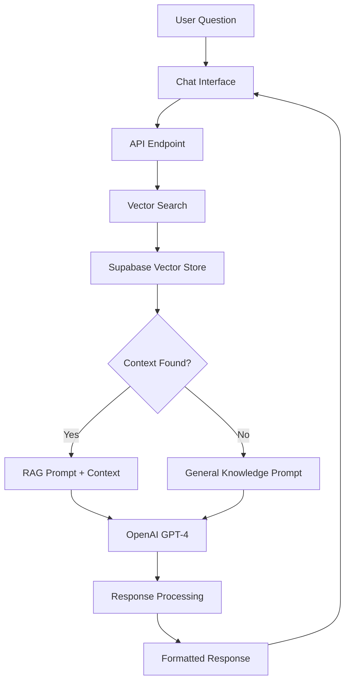

# AI Assistant Integration with RAG (Retrieval-Augmented Generation)

A comprehensive guide for implementing an AI-powered chat assistant with document-based knowledge retrieval using **OpenAI GPT-4**, **vector embeddings**, **Supabase vector storage**, and **Next.js**.

## Table of Contents

- [System Overview](#system-overview)
- [Architecture](#architecture)
- [Technology Stack](#technology-stack)
- [Database Setup](#1-database-setup)
- [Document Ingestion](#2-document-ingestion)
- [API Implementation](#3-api-implementation)
- [Chat Interface](#4-chat-interface)
- [Advanced Features](#5-advanced-features)
- [Environment Setup](#6-environment-setup)
- [Deployment & Optimization](#7-deployment--optimization)

## System Overview

This implementation provides a **RAG (Retrieval-Augmented Generation)** system that combines:

- **Knowledge Base**: PDF documents processed into searchable vector embeddings
- **Smart Retrieval**: Vector similarity search for relevant context
- **AI Generation**: OpenAI GPT-4 for contextual responses
- **Fallback System**: General knowledge when specific context isn't available
- **Modern UI**: Real-time chat interface with advanced message formatting

### Key Features

- ✅ **Document-based Q&A** with high accuracy
- ✅ **Automatic fallback** to general knowledge
- ✅ **Vector similarity search** for relevant context retrieval
- ✅ **Rich message formatting** with markdown support
- ✅ **Real-time streaming** responses
- ✅ **Mobile-responsive** chat interface
- ✅ **Error handling** and loading states
- ✅ **Analytics tracking** for usage insights

## Architecture



## Technology Stack

### Core Technologies

- **Frontend**: Next.js 14 (App Router), React, TypeScript
- **AI/ML**: OpenAI GPT-4, OpenAI Embeddings (text-embedding-ada-002)
- **Vector Database**: Supabase with pgvector extension
- **Document Processing**: LangChain, PDF.js
- **Styling**: Tailwind CSS, Lucide React Icons

### Key Libraries

```json
{
  "@ai-sdk/openai": "^0.0.66",
  "@langchain/openai": "^0.3.15",
  "@langchain/community": "^0.3.21",
  "@supabase/supabase-js": "^2.38.4",
  "ai": "^3.4.32",
  "langchain": "^0.3.7",
  "uuid": "^11.0.3"
}
```

## 1. Database Setup

### Supabase Vector Store Configuration

First, enable the pgvector extension and create the necessary tables:

```sql
-- Enable the pgvector extension
CREATE EXTENSION IF NOT EXISTS vector;

-- Create documents table for vector storage
CREATE TABLE documents (
  id BIGSERIAL PRIMARY KEY,
  content TEXT NOT NULL,
  metadata JSONB,
  embedding VECTOR(1536) -- OpenAI ada-002 embedding dimension
);

-- Create function for similarity search
CREATE OR REPLACE FUNCTION match_documents(
  query_embedding VECTOR(1536),
  match_threshold FLOAT DEFAULT 0.78,
  match_count INT DEFAULT 10
)
RETURNS TABLE (
  id BIGINT,
  content TEXT,
  metadata JSONB,
  similarity FLOAT
)
LANGUAGE SQL STABLE
AS $$
SELECT
  documents.id,
  documents.content,
  documents.metadata,
  1 - (documents.embedding <=> query_embedding) AS similarity
FROM documents
WHERE 1 - (documents.embedding <=> query_embedding) > match_threshold
ORDER BY similarity DESC
LIMIT match_count;
$$;

-- Create index for efficient similarity search
CREATE INDEX ON documents USING ivfflat (embedding vector_cosine_ops)
WITH (lists = 100);

-- Grant necessary permissions
GRANT SELECT, INSERT, UPDATE, DELETE ON documents TO anon;
GRANT SELECT, INSERT, UPDATE, DELETE ON documents TO authenticated;
GRANT USAGE, SELECT ON SEQUENCE documents_id_seq TO anon;
GRANT USAGE, SELECT ON SEQUENCE documents_id_seq TO authenticated;
```

## 2. Document Ingestion

### PDF Processing & Vector Storage

Create a script to process PDF documents and store them as searchable embeddings:

```javascript
// scripts/ingest-documents.mjs
import dotenv from "dotenv";
dotenv.config({ path: ".env.local" });

import { createClient } from "@supabase/supabase-js";
import { OpenAIEmbeddings } from "@langchain/openai";
import { PDFLoader } from "@langchain/community/document_loaders/fs/pdf";
import { RecursiveCharacterTextSplitter } from "langchain/text_splitter";
import { SupabaseVectorStore } from "@langchain/community/vectorstores/supabase";
import fs from "fs";

// Configuration
const PDF_PATH = "public/your-document.pdf";
const SUPABASE_URL = process.env.NEXT_PUBLIC_SUPABASE_URL;
const SUPABASE_SERVICE_KEY = process.env.SUPABASE_SERVICE_ROLE_KEY;
const OPENAI_API_KEY = process.env.OPENAI_API_KEY;

// Validation
if (!SUPABASE_URL || !SUPABASE_SERVICE_KEY || !OPENAI_API_KEY) {
  throw new Error("Missing required environment variables");
}

if (!fs.existsSync(PDF_PATH)) {
  throw new Error(`PDF file not found at: ${PDF_PATH}`);
}

const supabaseAdmin = createClient(SUPABASE_URL, SUPABASE_SERVICE_KEY);
const embeddings = new OpenAIEmbeddings({
  openAIApiKey: OPENAI_API_KEY,
  modelName: "text-embedding-ada-002",
});

// Text sanitization function
function sanitizeText(text) {
  if (!text) return "";
  return text.replace(/\u0000/g, "").replace(/\x00/g, "");
}

async function ingestDocument() {
  console.log("🚀 Starting document ingestion...");

  try {
    // 1. Load PDF
    console.log(`📖 Loading PDF: ${PDF_PATH}`);
    const loader = new PDFLoader(PDF_PATH);
    const documents = await loader.load();
    console.log(`✅ Loaded ${documents.length} pages from PDF`);

    if (documents.length === 0) {
      throw new Error("No content extracted from PDF");
    }

    // 2. Sanitize content
    const sanitizedDocs = documents.map((doc) => ({
      ...doc,
      pageContent: sanitizeText(doc.pageContent),
    }));

    // 3. Split into chunks
    console.log("✂️  Splitting document into chunks...");
    const textSplitter = new RecursiveCharacterTextSplitter({
      chunkSize: 1000, // Size of each chunk
      chunkOverlap: 200, // Overlap between chunks
      separators: ["\n\n", "\n", ".", "!", "?", ",", " ", ""],
    });

    const chunks = await textSplitter.splitDocuments(sanitizedDocs);
    console.log(`✅ Created ${chunks.length} chunks`);

    if (chunks.length === 0) {
      throw new Error("No chunks created from document");
    }

    // 4. Store with embeddings
    console.log("🔮 Generating embeddings and storing in Supabase...");
    await SupabaseVectorStore.fromDocuments(chunks, embeddings, {
      client: supabaseAdmin,
      tableName: "documents",
      queryName: "match_documents",
    });

    console.log("🎉 Document ingestion completed successfully!");
  } catch (error) {
    console.error("❌ Ingestion failed:", error);
    process.exit(1);
  }
}

// Run ingestion
ingestDocument();
```

### Run the Ingestion Script

```bash
# Make the script executable and run it
node scripts/ingest-documents.mjs
```

## 3. API Implementation

### RAG API Endpoint with Fallback

Create a robust API endpoint that implements RAG with intelligent fallback:

```typescript
// app/api/ask-ai/route.ts
import { openai } from "@ai-sdk/openai";
import { generateText, CoreMessage } from "ai";
import { NextResponse } from "next/server";
import { createClient } from "@supabase/supabase-js";
import { OpenAIEmbeddings } from "@langchain/openai";
import { SupabaseVectorStore } from "@langchain/community/vectorstores/supabase";

// Configuration
const SUPABASE_URL = process.env.NEXT_PUBLIC_SUPABASE_URL!;
const SUPABASE_ANON_KEY = process.env.NEXT_PUBLIC_SUPABASE_ANON_KEY!;
const OPENAI_API_KEY = process.env.OPENAI_API_KEY!;

const supabase = createClient(SUPABASE_URL, SUPABASE_ANON_KEY);
const embeddings = new OpenAIEmbeddings({
  openAIApiKey: OPENAI_API_KEY,
  modelName: "text-embedding-ada-002",
});

const vectorStore = new SupabaseVectorStore(embeddings, {
  client: supabase,
  tableName: "documents",
  queryName: "match_documents",
});

// Special marker for context not found
const CONTEXT_NOT_FOUND = "[[ANSWER_NOT_FOUND_IN_CONTEXT]]";

interface AIResponse {
  type: "contextual_answer" | "web_answer" | "error";
  content: string;
}

export async function POST(req: Request): Promise<Response> {
  try {
    const { question } = await req.json();

    if (!question?.trim()) {
      return NextResponse.json(
        { error: "Question is required" },
        { status: 400 }
      );
    }

    console.log(`[RAG] Processing question: "${question}"`);

    // Step 1: Retrieve relevant context
    let retrievedContext = "";
    let contextFound = false;

    try {
      const relevantChunks = await vectorStore.similaritySearch(question, 4);

      if (relevantChunks?.length > 0) {
        retrievedContext = relevantChunks
          .map((chunk) => chunk.pageContent)
          .join("\n---\n");
        contextFound = true;
        console.log(`[RAG] Found ${relevantChunks.length} relevant chunks`);
      }
    } catch (searchError: any) {
      console.error("[RAG] Search error:", searchError);
      return NextResponse.json(
        {
          error: "Failed to search knowledge base",
          details: searchError.message,
        },
        { status: 500 }
      );
    }

    // Step 2: If no context, use general knowledge
    if (!contextFound) {
      console.log("[RAG] No context found, using general knowledge");
      return await generateGeneralResponse(question);
    }

    // Step 3: Try contextual answer
    const contextualResponse = await generateContextualResponse(
      question,
      retrievedContext
    );

    // Step 4: Fallback to general if context insufficient
    if (contextualResponse.content === CONTEXT_NOT_FOUND) {
      console.log(
        "[RAG] Context insufficient, falling back to general knowledge"
      );
      return await generateGeneralResponse(question);
    }

    return NextResponse.json(contextualResponse);
  } catch (error: any) {
    console.error("[API] Error:", error);
    return NextResponse.json(
      {
        error: "Internal server error",
        details: error.message,
      },
      { status: 500 }
    );
  }
}

async function generateContextualResponse(
  question: string,
  context: string
): Promise<AIResponse> {
  const systemPrompt = `You are an AI assistant answering questions based on provided document context.

INSTRUCTIONS:
1. Use ONLY the provided context to answer questions
2. If the context contains relevant information, provide a helpful response
3. If the context does NOT contain sufficient information to answer the question, respond with EXACTLY: "${CONTEXT_NOT_FOUND}"
4. Do not mix partial answers with the special marker phrase

Context from documents:
${context}`;

  const messages: CoreMessage[] = [
    { role: "system", content: systemPrompt },
    {
      role: "user",
      content: `Question: ${question}\n\nProvide your answer based on the context above.`,
    },
  ];

  const { text } = await generateText({
    model: openai("gpt-4o"),
    messages,
    temperature: 0,
  });

  return {
    type: "contextual_answer",
    content: text.trim(),
  };
}

async function generateGeneralResponse(question: string): Promise<Response> {
  const systemPrompt = `You are a helpful AI assistant. Answer the user's question using your general knowledge. 
Provide accurate, comprehensive, and helpful information.`;

  const { text } = await generateText({
    model: openai("gpt-4o"),
    system: systemPrompt,
    prompt: question,
    temperature: 0.1,
  });

  const disclaimer =
    "\n\n*Note: This response is based on general knowledge. For specific or official information, please consult authoritative sources.*";

  return NextResponse.json({
    type: "web_answer",
    content: text + disclaimer,
  });
}
```

## 4. Chat Interface

### Advanced Chat Component

Create a modern, responsive chat interface with rich formatting:

```tsx
// app/ask-ai/page.tsx
"use client";

import React, { useState, useRef, useEffect } from "react";
import { Button } from "@/components/ui/button";
import { Input } from "@/components/ui/input";
import {
  Card,
  CardContent,
  CardHeader,
  CardTitle,
  CardDescription,
} from "@/components/ui/card";
import {
  Bot,
  User,
  Loader2,
  AlertTriangle,
  BookOpen,
  Globe,
  Send,
} from "lucide-react";
import { v4 as uuidv4 } from "uuid";

interface Message {
  id: string;
  role: "user" | "ai";
  content: string;
  type?: "contextual_answer" | "web_answer" | "error";
  timestamp: Date;
}

// Message formatting utilities
const formatAIResponse = (content: string) => {
  const paragraphs = content.split("\n\n").filter((p) => p.trim());

  return paragraphs.map((paragraph, index) => {
    // Handle numbered lists
    if (/^\d+\./.test(paragraph.trim())) {
      const lines = paragraph.split("\n");
      return (
        <div key={index} className="space-y-2 my-4">
          {lines.map((line, lineIndex) => {
            const match = line.match(/^(\d+\.)\s*(.*)$/);
            if (match) {
              const [, number, text] = match;
              return (
                <div key={lineIndex} className="flex items-start space-x-3">
                  <span className="flex-shrink-0 w-6 h-6 bg-blue-100 text-blue-700 rounded-full flex items-center justify-center text-sm font-bold">
                    {number.replace(".", "")}
                  </span>
                  <div className="flex-1 text-sm leading-relaxed">
                    {formatInlineText(text)}
                  </div>
                </div>
              );
            }
            return null;
          })}
        </div>
      );
    }

    // Handle bullet points
    if (paragraph.includes("•") || paragraph.includes("-")) {
      const lines = paragraph.split("\n");
      return (
        <div key={index} className="space-y-2 my-4">
          {lines.map((line, lineIndex) => {
            if (line.trim().startsWith("•") || line.trim().startsWith("-")) {
              const cleanLine = line.replace(/^[•-]\s*/, "");
              return (
                <div key={lineIndex} className="flex items-start space-x-3">
                  <span className="text-blue-500 font-bold mt-1">•</span>
                  <span className="text-sm leading-relaxed">
                    {formatInlineText(cleanLine)}
                  </span>
                </div>
              );
            }
            return null;
          })}
        </div>
      );
    }

    // Regular paragraphs
    return (
      <p key={index} className="text-sm leading-relaxed mb-4">
        {formatInlineText(paragraph)}
      </p>
    );
  });
};

const formatInlineText = (text: string) => {
  // Handle bold text (**text**)
  const parts = text.split(/(\*\*[^*]+\*\*)/g);

  return parts.map((part, index) => {
    if (part.startsWith("**") && part.endsWith("**")) {
      return (
        <strong key={index} className="font-semibold text-gray-900">
          {part.slice(2, -2)}
        </strong>
      );
    }
    return <span key={index}>{part}</span>;
  });
};

export default function AIChat() {
  const [messages, setMessages] = useState<Message[]>([
    {
      id: uuidv4(),
      role: "ai",
      content:
        "Hello! I'm your AI assistant. Ask me anything and I'll help you find the information you need.",
      type: "contextual_answer",
      timestamp: new Date(),
    },
  ]);
  const [inputValue, setInputValue] = useState("");
  const [isLoading, setIsLoading] = useState(false);
  const messagesEndRef = useRef<HTMLDivElement>(null);

  const scrollToBottom = () => {
    messagesEndRef.current?.scrollIntoView({ behavior: "smooth" });
  };

  useEffect(() => {
    scrollToBottom();
  }, [messages]);

  const handleSubmit = async (e: React.FormEvent) => {
    e.preventDefault();
    const question = inputValue.trim();
    if (!question) return;

    // Add user message
    const userMessage: Message = {
      id: uuidv4(),
      role: "user",
      content: question,
      timestamp: new Date(),
    };

    setMessages((prev) => [...prev, userMessage]);
    setInputValue("");
    setIsLoading(true);

    // Add temporary loading message
    const loadingId = uuidv4();
    const loadingMessage: Message = {
      id: loadingId,
      role: "ai",
      content: "Thinking...",
      type: "contextual_answer",
      timestamp: new Date(),
    };

    setMessages((prev) => [...prev, loadingMessage]);

    try {
      const response = await fetch("/api/ask-ai", {
        method: "POST",
        headers: { "Content-Type": "application/json" },
        body: JSON.stringify({ question }),
      });

      if (!response.ok) {
        throw new Error(`Request failed with status ${response.status}`);
      }

      const data = await response.json();

      // Replace loading message with actual response
      setMessages((prev) =>
        prev.map((msg) =>
          msg.id === loadingId
            ? {
                ...msg,
                content: data.content,
                type: data.type,
              }
            : msg
        )
      );
    } catch (error) {
      console.error("Chat error:", error);

      // Replace loading message with error
      setMessages((prev) =>
        prev.map((msg) =>
          msg.id === loadingId
            ? {
                ...msg,
                content: "Sorry, I encountered an error. Please try again.",
                type: "error",
              }
            : msg
        )
      );
    } finally {
      setIsLoading(false);
    }
  };

  return (
    <div className="w-full max-w-4xl mx-auto h-[calc(100vh-2rem)] flex flex-col p-4">
      <Card className="flex-1 flex flex-col shadow-xl">
        <CardHeader className="bg-gradient-to-r from-blue-600 to-blue-700 text-white">
          <CardTitle className="flex items-center text-xl">
            <Bot className="mr-3 h-8 w-8" />
            AI Assistant
          </CardTitle>
          <CardDescription className="text-blue-100">
            Get instant answers to your questions
          </CardDescription>
        </CardHeader>

        <CardContent className="flex-1 flex flex-col p-6 min-h-0">
          {/* Messages */}
          <div className="flex-1 overflow-y-auto space-y-6 mb-6">
            {messages.map((message) => (
              <div
                key={message.id}
                className={`flex ${
                  message.role === "user" ? "justify-end" : "justify-start"
                }`}
              >
                <div
                  className={`max-w-[85%] rounded-2xl p-4 ${
                    message.role === "user"
                      ? "bg-blue-600 text-white"
                      : message.type === "error"
                      ? "bg-red-50 border border-red-200 text-red-800"
                      : "bg-white border border-gray-200 shadow-md"
                  }`}
                >
                  {/* Message Header */}
                  {message.role === "ai" && message.type !== "error" && (
                    <div className="flex items-center justify-between mb-2 pb-2 border-b border-gray-100">
                      <div className="flex items-center space-x-2">
                        <Bot className="h-4 w-4 text-blue-500" />
                        <span className="text-xs font-semibold text-gray-600 uppercase">
                          AI Assistant
                        </span>
                        {message.type === "contextual_answer" && (
                          <div className="flex items-center space-x-1 bg-green-100 px-2 py-0.5 rounded-full">
                            <BookOpen className="h-3 w-3 text-green-600" />
                            <span className="text-xs text-green-700 font-medium">
                              Knowledge Base
                            </span>
                          </div>
                        )}
                        {message.type === "web_answer" && (
                          <div className="flex items-center space-x-1 bg-blue-100 px-2 py-0.5 rounded-full">
                            <Globe className="h-3 w-3 text-blue-600" />
                            <span className="text-xs text-blue-700 font-medium">
                              General Knowledge
                            </span>
                          </div>
                        )}
                      </div>
                    </div>
                  )}

                  {/* User Message Header */}
                  {message.role === "user" && (
                    <div className="flex items-center space-x-2 mb-2">
                      <User className="h-4 w-4 opacity-90" />
                      <span className="text-xs font-medium opacity-90 uppercase">
                        You
                      </span>
                    </div>
                  )}

                  {/* Error Header */}
                  {message.type === "error" && (
                    <div className="flex items-center space-x-2 mb-2">
                      <AlertTriangle className="h-4 w-4 text-red-600" />
                      <span className="text-sm font-semibold text-red-700">
                        Error
                      </span>
                    </div>
                  )}

                  {/* Message Content */}
                  <div className="text-sm leading-relaxed">
                    {message.role === "ai" && message.type !== "error" ? (
                      <div className="prose prose-sm max-w-none">
                        {formatAIResponse(message.content)}
                      </div>
                    ) : (
                      <div className="whitespace-pre-wrap">
                        {message.content}
                      </div>
                    )}
                  </div>

                  {/* Timestamp */}
                  <div className="mt-2 text-xs opacity-70">
                    {message.timestamp.toLocaleTimeString([], {
                      hour: "2-digit",
                      minute: "2-digit",
                    })}
                  </div>
                </div>
              </div>
            ))}

            {/* Loading Indicator */}
            {isLoading && (
              <div className="flex justify-start">
                <div className="bg-white border border-gray-200 rounded-2xl p-4 shadow-md">
                  <div className="flex items-center space-x-3">
                    <Bot className="h-5 w-5 text-blue-500" />
                    <div className="flex space-x-1">
                      <div className="w-2 h-2 bg-blue-500 rounded-full animate-bounce"></div>
                      <div className="w-2 h-2 bg-blue-500 rounded-full animate-bounce [animation-delay:0.1s]"></div>
                      <div className="w-2 h-2 bg-blue-500 rounded-full animate-bounce [animation-delay:0.2s]"></div>
                    </div>
                    <span className="text-sm text-gray-600">Thinking...</span>
                  </div>
                </div>
              </div>
            )}

            <div ref={messagesEndRef} />
          </div>

          {/* Input Form */}
          <form onSubmit={handleSubmit} className="border-t pt-4">
            <div className="flex items-end space-x-3 bg-gray-50 rounded-2xl p-3 border-2 border-transparent focus-within:border-blue-300">
              <Input
                type="text"
                value={inputValue}
                onChange={(e) => setInputValue(e.target.value)}
                placeholder="Ask me anything..."
                disabled={isLoading}
                className="flex-grow border-0 bg-transparent focus:ring-0 text-gray-800"
              />
              <Button
                type="submit"
                disabled={isLoading || !inputValue.trim()}
                className="bg-blue-600 hover:bg-blue-700 rounded-xl px-6 py-2"
              >
                {isLoading ? (
                  <Loader2 className="h-4 w-4 animate-spin" />
                ) : (
                  <div className="flex items-center space-x-2">
                    <span className="font-medium">Send</span>
                    <Send className="h-4 w-4" />
                  </div>
                )}
              </Button>
            </div>
          </form>

          {/* Tips */}
          <div className="mt-3 text-center">
            <p className="text-xs text-gray-500">
              💡 Try asking specific questions for more accurate answers
            </p>
          </div>
        </CardContent>
      </Card>
    </div>
  );
}
```

## 5. Advanced Features

### Analytics Integration

Track AI assistant usage for insights:

```typescript
// lib/analytics.ts
export const trackAIUsage = {
  questionAsked: (question: string, responseType: string) => {
    // Track with your analytics service
    console.log("AI Question:", { question, responseType });
  },

  responseGenerated: (responseTime: number, tokensUsed: number) => {
    // Track performance metrics
    console.log("AI Response:", { responseTime, tokensUsed });
  },
};
```

### Conversation Memory

Add conversation context for better responses:

```typescript
// Enhanced API with conversation history
export async function POST(req: Request) {
  const { question, conversationHistory = [] } = await req.json();

  // Include previous context in prompts
  const conversationContext = conversationHistory
    .slice(-3) // Keep last 3 exchanges
    .map((msg: any) => `${msg.role}: ${msg.content}`)
    .join("\n");

  const enhancedPrompt = `Previous conversation:\n${conversationContext}\n\nCurrent question: ${question}`;

  // Process with enhanced context...
}
```

### Rate Limiting

Implement usage limits:

```typescript
// lib/rate-limit.ts
import { createClient } from "@supabase/supabase-js";

export async function checkRateLimit(userId: string): Promise<boolean> {
  const supabase = createClient(/* ... */);

  const { data } = await supabase
    .from("ai_usage")
    .select("count")
    .eq("user_id", userId)
    .eq("date", new Date().toISOString().split("T")[0])
    .single();

  const dailyLimit = 50; // Adjust as needed
  return (data?.count || 0) < dailyLimit;
}
```

## 6. Environment Setup

### Required Environment Variables

```bash
# .env.local

# OpenAI Configuration
OPENAI_API_KEY=sk-your-openai-api-key

# Supabase Configuration
NEXT_PUBLIC_SUPABASE_URL=https://your-project.supabase.co
NEXT_PUBLIC_SUPABASE_ANON_KEY=your-anon-key
SUPABASE_SERVICE_ROLE_KEY=your-service-role-key

# Optional: Analytics
NEXT_PUBLIC_ANALYTICS_ID=your-analytics-id
```

### Package Installation

```bash
# Core dependencies
npm install @ai-sdk/openai ai @langchain/openai @langchain/community
npm install @supabase/supabase-js langchain uuid

# UI dependencies
npm install lucide-react @radix-ui/react-dialog
npm install tailwindcss @tailwindcss/typography

# Development dependencies
npm install -D @types/uuid dotenv
```

### Project Structure

```text
your-app/
├── app/
│   ├── api/
│   │   └── ask-ai/
│   │       └── route.ts          # RAG API endpoint
│   └── ask-ai/
│       └── page.tsx              # Chat interface
├── components/
│   └── ui/                       # Shadcn UI components
├── lib/
│   ├── analytics.ts              # Usage tracking
│   └── rate-limit.ts             # Usage limits
├── scripts/
│   └── ingest-documents.mjs      # Document processing
└── public/
    └── your-document.pdf         # Source document
```

## 7. Deployment & Optimization

### Performance Optimization

```typescript
// Implement caching for frequently asked questions
const cache = new Map<string, any>();

export async function POST(req: Request) {
  const { question } = await req.json();

  // Check cache first
  const cacheKey = question.toLowerCase().trim();
  if (cache.has(cacheKey)) {
    return NextResponse.json(cache.get(cacheKey));
  }

  // Generate response...
  const response = await generateResponse(question);

  // Cache the result
  cache.set(cacheKey, response);

  return NextResponse.json(response);
}
```

### Error Monitoring

```typescript
// Add comprehensive error logging
export async function POST(req: Request) {
  try {
    // ... implementation
  } catch (error) {
    console.error("AI API Error:", {
      error: error.message,
      stack: error.stack,
      timestamp: new Date().toISOString(),
      request: { question },
    });

    // Report to error monitoring service
    // Sentry.captureException(error);

    return NextResponse.json(
      { error: "Service temporarily unavailable" },
      { status: 500 }
    );
  }
}
```

### Deployment Checklist

- [ ] Set up Supabase project with pgvector extension
- [ ] Configure OpenAI API access
- [ ] Set all environment variables
- [ ] Run document ingestion script
- [ ] Test RAG functionality
- [ ] Implement rate limiting
- [ ] Set up error monitoring
- [ ] Configure analytics tracking
- [ ] Test mobile responsiveness
- [ ] Optimize for Core Web Vitals

## Usage Examples

### Basic Question

```text
User: "What is machine learning?"
AI: [Searches knowledge base] → [Context found] → [Contextual response with source attribution]
```

### Fallback Example

```text
User: "What's the weather like today?"
AI: [Searches knowledge base] → [No relevant context] → [General knowledge response with disclaimer]
```

### Complex Query

```text
User: "How does neural network training work with backpropagation?"
AI: [Vector search] → [Multiple relevant chunks] → [Comprehensive answer synthesized from multiple sources]
```

This implementation provides a robust, scalable AI assistant that can be customized for any domain-specific knowledge base while maintaining excellent user experience and performance.

## Contributing

When extending this system:

- Add proper TypeScript types for all new components
- Implement comprehensive error handling
- Add unit tests for critical functions
- Document any new configuration options
- Consider mobile-first responsive design
- Optimize for accessibility (WCAG guidelines)

## License

This implementation guide follows modern AI and web development best practices and can be adapted for various use cases while maintaining high performance and user experience standards.
