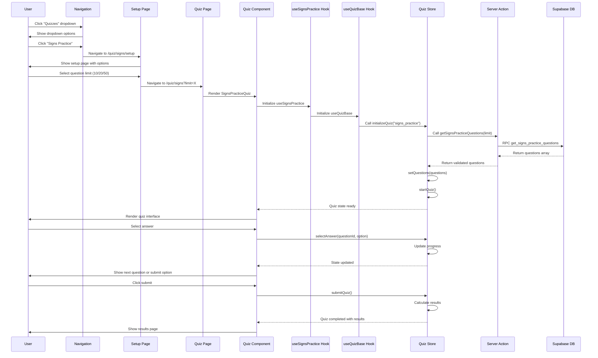
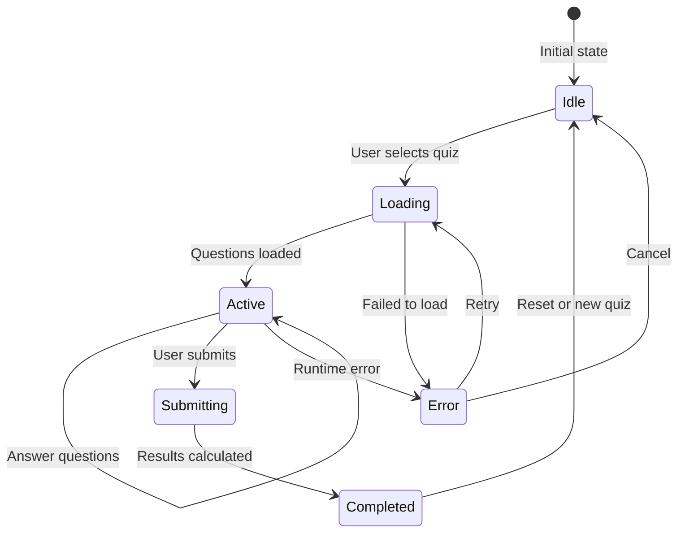
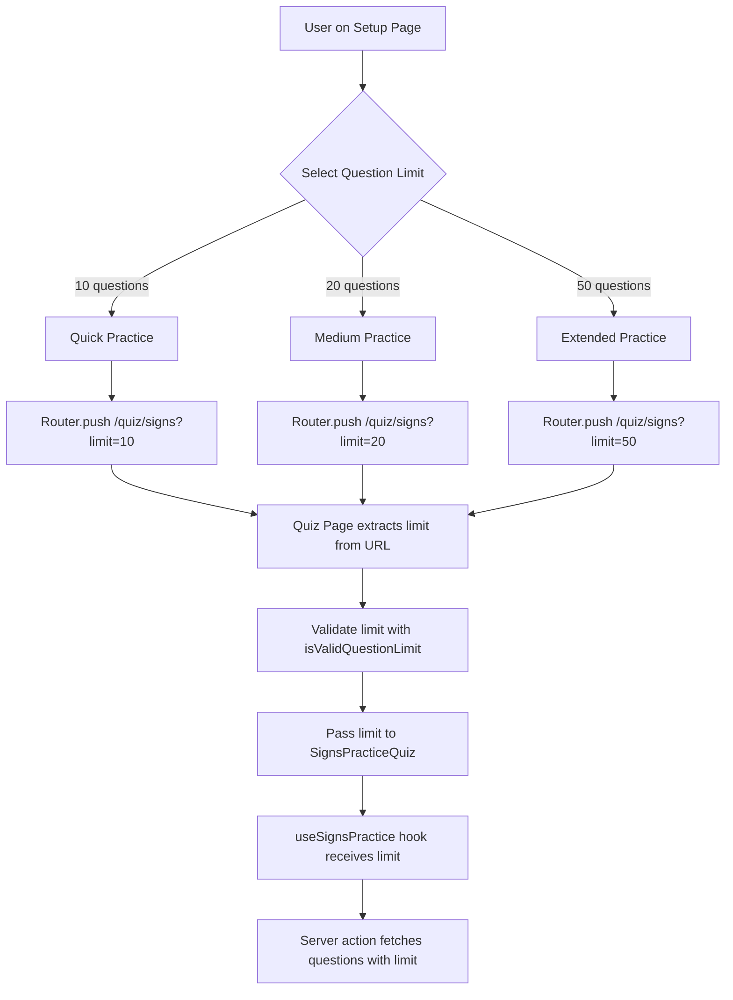
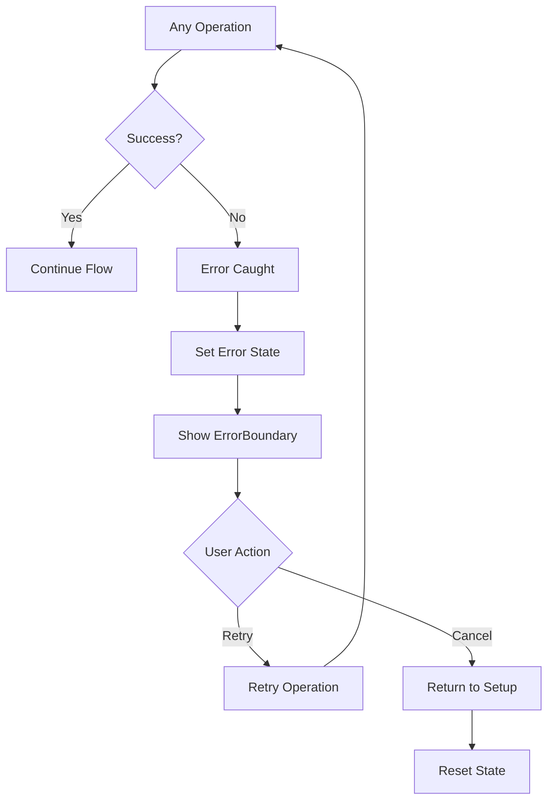

# Signs Quiz Flow - Visual Diagram

## Complete Flow Diagram

```mermaid
graph TD
    A[User clicks "Quizzes" dropdown] --> B[Navigation Component<br/>components/navigation.tsx]
    B --> C[User clicks "Signs Practice"]
    C --> D[Navigate to /quiz/signs/setup]
    D --> E[SignsPracticeSetupPage<br/>app/quiz/signs/setup/page.tsx]
    E --> F[PracticeSetupPage Component<br/>components/quiz/setup/PracticeSetupPage.tsx]
    F --> G[User selects question limit<br/>10, 20, or 50 questions]
    G --> H[Router.push to /quiz/signs?limit=X]
    H --> I[SignsPracticePage<br/>app/quiz/signs/page.tsx]
    I --> J[SignsPracticeQuiz Component<br/>components/quiz/modes/SignsPracticeQuiz.tsx]
    J --> K[useSignsPractice Hook<br/>hooks/quiz/useSignsPractice.ts]
    K --> L[useQuizBase Hook<br/>hooks/quiz/useQuizBase.ts]
    L --> M[Quiz Store - initializeQuiz<br/>stores/quiz/quizStore.ts]
    M --> N[getSignsPracticeQuestions<br/>lib/quiz/server-actions.ts]
    N --> O[Supabase RPC Call<br/>get_signs_practice_questions]
    O --> P[Questions loaded into Quiz Store]
    P --> Q[Quiz Store - startQuiz]
    Q --> R[QuizContainer renders quiz UI]
    R --> S[QuestionDisplay shows current question]
    S --> T[AnswerOptions for user selection]
    T --> U[User selects answer A, B, C, or D]
    U --> V[Quiz Store - selectAnswer]
    V --> W[NavigationControls for next/prev/submit]
    W --> X{More questions?}
    X -->|Yes| Y[Next question]
    Y --> S
    X -->|No| Z[User clicks Submit]
    Z --> AA[Quiz Store - submitQuiz]
    AA --> BB[Calculate results and score]
    BB --> CC[ResultsDisplay shows final score]
```

## Detailed Component Interaction Flow



## State Management Flow



## Data Flow Architecture

```mermaid
graph LR
    subgraph "Frontend Components"
        A[Navigation] --> B[Setup Page]
        B --> C[Quiz Page]
        C --> D[Quiz Component]
    end

    subgraph "Hooks Layer"
        E[useSignsPractice] --> F[useQuizBase]
    end

    subgraph "State Management"
        G[Quiz Store - Zustand]
    end

    subgraph "Server Layer"
        H[Server Actions]
    end

    subgraph "Database"
        I[Supabase RPC Functions]
        J[Questions Database]
    end

    D --> E
    F --> G
    G --> H
    H --> I
    I --> J

    J --> I
    I --> H
    H --> G
    G --> F
    F --> E
    E --> D
```



## Key Files and Their Roles

### Navigation Layer

- **`components/navigation.tsx`**: Main navigation with dropdown menu
- **`app/quiz/signs/setup/page.tsx`**: Setup page entry point

### Setup Layer

- **`components/quiz/setup/PracticeSetupPage.tsx`**: Generic setup component
- **`app/quiz/signs/page.tsx`**: Quiz page with URL parameter handling

### Quiz Layer

- **`components/quiz/modes/SignsPracticeQuiz.tsx`**: Main quiz component
- **`components/quiz/core/QuizContainer.tsx`**: Layout wrapper
- **`components/quiz/core/QuestionDisplay.tsx`**: Question rendering
- **`components/quiz/core/AnswerOptions.tsx`**: Answer selection UI
- **`components/quiz/core/NavigationControls.tsx`**: Navigation buttons
- **`components/quiz/core/ProgressIndicator.tsx`**: Progress display

### Hook Layer

- **`hooks/quiz/useSignsPractice.ts`**: Signs-specific quiz logic
- **`hooks/quiz/useQuizBase.ts`**: Common quiz functionality

### State Layer

- **`stores/quiz/quizStore.ts`**: Zustand store for quiz state
- **`stores/quiz/selectors.ts`**: Optimized state selectors

### Server Layer

- **`lib/quiz/server-actions.ts`**: Server actions for data fetching
- **`lib/quiz/constants.ts`**: Quiz configuration constants
- **`lib/quiz/utils.ts`**: Utility functions

### Database Layer

- **Supabase RPC Functions**: `get_signs_practice_questions`
- **Questions Tables**: `signs_questions`, `rules_questions`

## Question Limit Flow



## Error Handling Flow



This comprehensive flow shows how the signs quiz system works from the initial user interaction through to completion, including all the key components, state management, error handling, and data flow.
